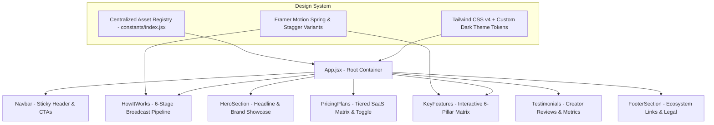

# ⚡ StreamPulse — The Ultimate Creator Broadcast & Stream Toolkit

<p align="center">
  
</p>

<p align="center">
  <strong>Next-Generation SaaS Operations & Audience Engagement Hub for Live Broadcasters</strong>
</p>

<p align="center">
  <a href="#-key-features"></a>
  <a href="#-tech-stack"></a>
  <a href="#-tech-stack"></a>
  <a href="#-tech-stack"></a>
  <a href="https://github.com/dk5488/StreamPulse"></a>
  <a href="#-license"></a>
</p>

---

## 📖 Executive Summary

**StreamPulse** is a high-performance, dark-themed SaaS web platform engineered specifically for live streamers, gaming creators, and digital broadcasters across Twitch, YouTube, and multi-cast platforms.

Built with cutting-edge **React 19**, **Vite 7**, **Tailwind CSS v4**, and **Framer Motion 12**, StreamPulse merges hyper-fluid micro-interactions with a conversion-optimized user experience. It highlights live streaming analytics, automated overlay management, audience interaction systems, and multi-tier monetization workflows in a unified, modern interface.

---

## ✨ Key Features & Capabilities

### 📊 Real-Time Stream Analytics 2.0
* **Live Telemetry:** Monitor audience retention, concurrent viewer peaks, and chat velocity across simultaneous platforms.
* **Viewer Heatmaps & Churn Analysis:** Uncover drop-off points and high-energy segments during live broadcasts.

### 🎮 Automated Stream Control & Overlays
* **Zero-Latency Custom Alerts:** Dynamic reactive banners for subscriptions, raids, gifted memberships, and superchats.
* **Cross-Platform Scheduler:** Coordinate stream announcements, reminders, and social pushes directly from one calendar.

### 🌐 Multi-Platform Broadcast Ecosystem
* **Twitch & YouTube API Synergy:** Native integrations to sync moderator controls, follower counters, and revenue dashboards.
* **Unified Stream Overlays:** Responsive web-based HUD overlays that dynamically scale from 720p up to 4K Ultra HD.

### 💎 Tiered Monetization & Subscription Funnel
* **Interactive Pricing Matrices:** Flexible subscriptions (Basic, Pro, and Elite) tailored for hobbyist creators to professional esports organizations.
* **Sponsorship & Donation Gateways:** Seamlessly promote sponsor highlights and tip jars without stream clutter.

---

## 🏗️ Architecture & Component Flow



---

## 🛠️ Tech Stack

| Layer | Technology | Purpose |
| :--- | :--- | :--- |
| **Frontend Core** | `React 19.2` | Component architecture leveraging latest React compiler and concurrency features |
| **Build Engine** | `Vite 7.2` | Sub-millisecond Hot Module Replacement (HMR) and optimized rollup production bundles |
| **Design Framework** | `Tailwind CSS v4` | Modern CSS architecture with zero-runtime utility styling and `@tailwindcss/vite` |
| **Motion Physics** | `Framer Motion 12` | Fluid physics-based scroll triggers, hover depth effects, and stagger animations |
| **Iconography** | `Remix Icon` + `React Icons` | Crisp, scalable SVG vector icons for creator metrics and stream platforms |

---

## 📁 Repository Structure

```text
source/
├── public/                 # Static assets & favicon
│   └── vite.svg
├── src/
│   ├── assets/             # Brand logos, creator photography, UI graphics
│   │   ├── broadcastly-logo.png
│   │   ├── cloudcast-logo.png
│   │   ├── streamlabs-logo.png
│   │   ├── hero.jpg
│   │   └── user[1-6].jpeg
│   ├── components/         # Atomic & section UI modules
│   │   ├── Navbar/         # Responsive navigation & action triggers
│   │   ├── HeroSection/    # Main value proposition & brand ribbon
│   │   └── FooterSection/  # Ecosystem links, socials & newsletter
│   ├── pages/              # Landing sections
│   │   ├── HowItWorks.jsx  # 6-step streaming lifecycle
│   │   ├── KeyFeatures.jsx # Grid of core platform capabilities
│   │   ├── PricingPlans.jsx# Basic, Pro & Elite pricing cards
│   │   └── Testimonials.jsx# Creator proof & authentic reviews
│   ├── constants/          # Structured JSON data models & copy
│   │   └── index.jsx
│   ├── App.jsx             # Main application orchestrator
│   ├── App.css             # Component-level layout overrides
│   ├── index.css           # Global typography & Tailwind theme definitions
│   └── main.jsx            # React root mount point
├── eslint.config.js        # Modern flat ESLint configuration
├── package.json            # Dependencies & npm scripts
└── vite.config.js          # Vite configuration with React & Tailwind plugins
```

---

## 🚀 Quickstart & Local Development

### Prerequisites
* **Node.js**: v18.0.0 or higher
* **npm** or **pnpm** / **yarn**

### 1. Installation
Clone the repository and install project dependencies:
```bash
# Clone the repository
git clone https://github.com/dk5488/StreamPulse.git

# Navigate into the project directory
cd StreamPulse

# Install packages
npm install
```

### 2. Run Local Development Server
Start Vite's local dev server with lightning-fast HMR:
```bash
npm run dev
```
Navigate to `http://localhost:5173` in your browser.

### 3. Production Build
Create an optimized production bundle:
```bash
npm run build
```
Preview the built distribution locally:
```bash
npm run preview
```

---

## 🎨 Design System & Customization

### Modifying Copy and Content
All headline copy, pricing tiers, testimonial reviews, and feature points are fully decoupled from layout markup in [`src/constants/index.jsx`](src/constants/index.jsx):
* Edit `HERO_CONTENT` to alter top-of-fold messaging.
* Edit `PLANS_CONTENT` to adjust monthly pricing and feature checkmarks.
* Edit `HOW_IT_WORKS_CONTENT` to update the step-by-step broadcast lifecycle.

### Styling & Theme Tokens
Global theme styles, background gradients, and base font definitions reside in [`src/index.css`](src/index.css), styled with modern Tailwind CSS v4 variables.

---

## 📦 Deployment Guides

### Vercel (Recommended)
1. Push your repository to GitHub.
2. Import the project into your [Vercel Dashboard](https://vercel.com).
3. Framework Preset: **Vite**.
4. Root Directory: `source` (or root if standalone).
5. Click **Deploy**.

### Cloudflare Pages / Netlify
* **Build Command:** `npm run build`
* **Output Directory:** `dist`
* **Node Version:** `>= 18`

---

## 📄 License

Distributed under the **MIT License**. See `LICENSE` for more information.

---

<p align="center">
  Crafted for creators who demand high-fidelity broadcasts and actionable stream telemetry.
</p>
